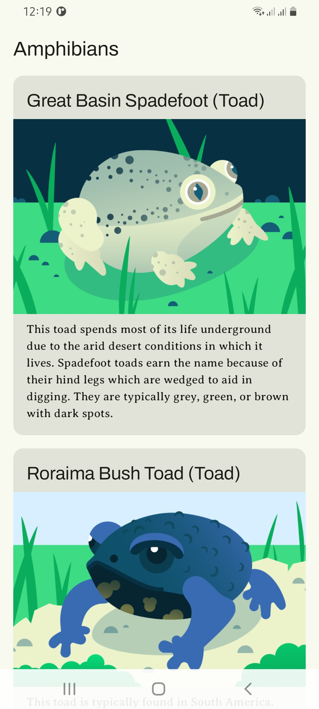

# Amphibians  

An Android app built with **Kotlin** and **Jetpack Compose** that shows information about different amphibian species. Data is loaded from a web API and displayed with names, descriptions, and images.

This project was built as a practice project while following the [Android Basics with Compose Unit 5: Load and display images from the internet](https://developer.android.com/courses/pathways/android-basics-compose-unit-5-pathway-2) codelab.

---

## Features  
- Browse a list of amphibians with name, type, description, and image  
- Data is loaded from a remote API  
- Clean UI built with Jetpack Compose  
- Uses Android best practices with separation of concerns  

---

## Screenshot  
  

---

## Tech Stack
- **Language:** Kotlin  
- **UI:** Jetpack Compose  
- **Networking:** Retrofit  
- **Image Loading:** Coil  
- **Architecture:** MVVM with ViewModel + Repository pattern  

---

## Setup  
### Clone the repo  
   ```bash
   git clone https://github.com/am0520/Amphibians.git
